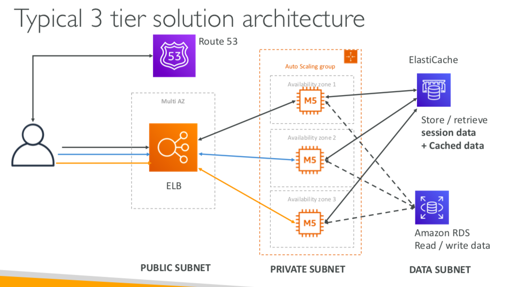

# AWS Notes for Exam

-----

## Security

### IAM

### Cognito

### KMS

-----

## Compute

### EC2

* Security Groups
  * SGs control inbound/outbound traffic of EC2 machines (think as "firewall")
  * All inbound traffic is blocked by default
  * All outbound traffic is authorised by default
  * Errors
    * timeout (not accessible) - sg issue
    * connection refused - application error

* EC2 Instance Types
  1. On Demand Instance
      * applications with short term, spiky or unpredictable workloads
      * applications being developed or tested on EC2
  2. Reserved Instance
      * capacity reservation (1 or 3 year terms)
      * application with steady state or predictable usage (e.g. web servers)
  3. Spot Instance
      * **bid** whatever price you want for instance capacity (less reliable)
      * applications that have flexible start and end times
      * users with an urgent need for large amount of addtional computing capacity
  4. Dedicated Hosts
      * an entire physical server dedicated for your use (BYOL, Bring Your Own License)
      * useful for regulatory requirements that may not support multi-tenant virtualization or cloud deployments

* ELB
  * CLB - v1, HTTP/HTTPS/TCP
  * ALB - v2, HTTP/HTTPS/WebSocket
    * The application servers don't see the IP of the client directly.
    * The true IP of the client is inserted in the header **X-Forwarded-For**.
    * We can also get Port (X-Forwarded-Port) and proto (X-Forwarded-Proto).
  * NLB - v2, TCP/TLS (secure TCP)/UDP

* Load Balancer Stickiness (works for CLB and ALB)
  * the same client is always redirected to the same instance behind a load balancer
  * Use case: make sure the user doesn't lose his **session data**
  * Enabling stickiness may bring imbalance to the load over the backend EC2 instances

* Cross-Zone Load Balancing: each load balancer instance distributes evenly across all registered instances in all AZ, otherwise it's in the same AZ only

* Auto Scailing Group
  * Scaling policies can be on CPU, Network... and can even be on custom metrics or based on a schedule (if you know your visitors patterns)
  * IAM roles attached to an ASG will get assigned to EC2 instances
  * ASG can terminate instances marked as unhealthy by an LB (and hence replace them)

* EBS
  * An EBS (Elastic Block Store) Volume is a **network drive** you can attach
 to your instances while they run. It allows your instances to **persist data**
  * It can be attached to only one instance at a time
  * It’s locked to an Availability Zone. To move a volume across, you first need to snapshot it

### Lambda

### Elastic Beanstalk

-----

## Database

### RDS

* RDS Backups
  * Automated backups
  * DB Snapshots

* RDS Read Replicas
  * Up to 5 Read Replicas
  * Within AZ, Cross AZ Application or Cross Region
  * Replication is ASYNC, so reads are eventually consistent

* RDS Multi AZ (Disaster Recovery)
  * SYNC replication
  * One DNS name – automatic app failover to standby
  * Not used for scaling

* RDS Security - Encryption
  * At rest encryption
    * Possibility to encrypt the master & read replicas with AWS KMS - AES-256 encryption
    * Encryption has to be defined at launch time or use snapshot (see below)
    * If the master is not encrypted, the read replicas cannot be encrypted
  * In-flight encryption
    * SSL certificates to encrypt data to RDS in flight

  * To encrypt an un-encrypted RDS database:
    1. Create a snapshot of the un-encrypted database
    2. Copy the snapshot and enable encryption for the snapshot
    3. Restore the database from the encrypted snapshot
    4. Migrate applications to the new database, and delete the old database

### ElastiCache

* Applications queries ElastiCache, if not available, get from RDS and store in ElastiCache

* Use cases:
  * DB Cache
  * User session store

* Redis
  * Multi AZ
  * Read Replicas
  * Backup and restore features

* Memcached
  * Multi-node for partitioning of data (sharding)
  * Multi-threaded
  * No backup and restore

* 2 Caching strategies
  * Lazy Loading/Cache-Aside/Lazy Population
  * Write Through

* Cache Evictions
  1. You delete the item explicitly in the cache
  2. **LRU** - Item is evicted because the memory is full and it’s not recently used
  3. **TTL** - You set an item time-to-live

### DynamoDB

-----

## Storage

### S3

* There’s no concept of “directories” within buckets. Just keys with very long names that contain slashes

* Max Object Size is 5 TB. If uploading more than 5GB, must use **multi-part upload**

* There are 4 methods of encrypting objects in S3
  * SSE-S3
    * Encryption using keys handled & managed by AWS
    * Object is encrypted server side
    * Must set header: **"x-amz-server-side-encryption": "AES256"**
  * SSE-KMS
    * Encryption using AWS KMS to manage and handle keys
    * Object is encrypted server side
    * Must set header: **"x-amz-server-side-encryption": ”aws:kms"**
  * SSE-C
    * Server-side encryption using data keys fully managed by the customer outside of AWS
    * Amazon S3 does not store the encryption key you provide
    * HTTPS must be used
  * Client Side Encryption
    * Clients must encrypt data themselves before sending to S3
    * Customer fully manages the keys and encryption cycle

* CORS (Cross-Origin Resource Sharing)
  * Web browser based mechanism to allow requests to other origins while visiting the main origin (Same origin: http://example.com/app1 & http://example.com/app2)
  * If a client does a cross-origin request on our S3 bucket, we need to enable the correct CORS headers

* Consistency Model
  * Read after write consistency for PUTS of new objects. Except if we did a GET before to see if the object existed. e.g. (GET 404 => PUT 200 => GET 404) – eventually consistent
  * Eventual Consistency for DELETES and PUTS of existing objects
  * There’s no way to request strong consistency

* S3 Replication
  * **Must enable versioning** in source and destination
  * Buckets can be in different accounts
  * Copying is asynchronous
  * After activating replication, only new objects are replicated (not retroactive)
  * CRR (Cross Region Replication) - compliance, lower latency access, replication across accounts
  * SRR (Same Region Replication) - log aggregation, live replication between production and test accounts

-----

## Networking

### API Gateway

-----

## Development

### X-Ray

### CodeCommit

### CodeBuild

### CodeDeploy

### CodePipeline

-----

## Application Integration

### SQS

### SNS

-----

## Analytics

### Kinesis

-----

## Management

### CloudFormation

### CloudWatch

### CloudTrail
