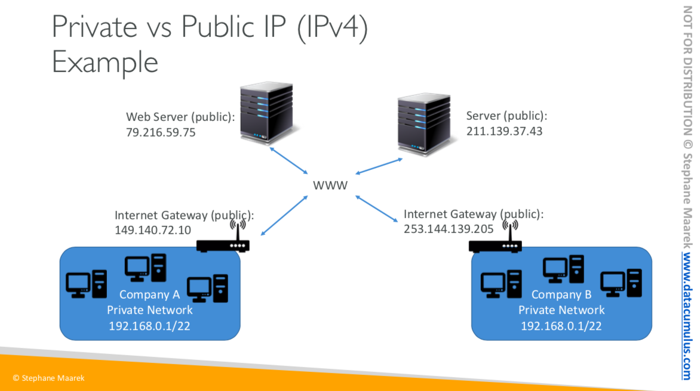
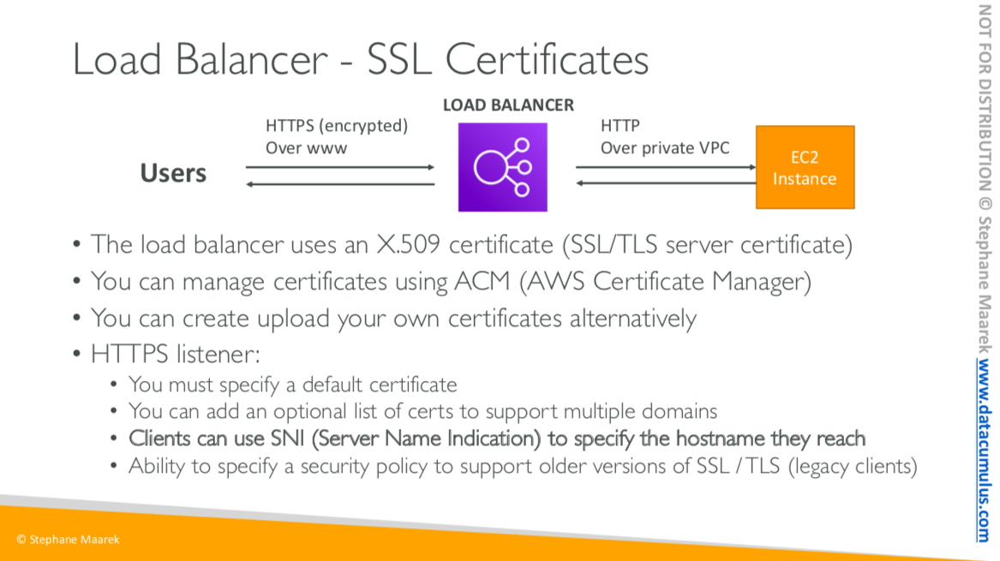

# AWS Note

Based on [Udemy: Ultimate AWS Certified Developer Associate 2020](https://www.udemy.com/course/aws-certified-developer-associate-dva-c01)

## TODOs

* Hands On
  * ALB (34)
  * EBS (44)
  * EFS (48)
* Review lecture PDF
* Mock exam

## Basics

* AWS Availability Zones (AZ) - Geographically-isolated (but connected) data centers
* Check [Region Table](https://aws.amazon.com/about-aws/global-infrastructure/regional-product-services/?p=ngi&loc=4) if the service you want to use is not supported in your current region.

-----

## IAM, Identity and Access Management (Global Service)

* IAM is at the center of AWS as your whole AWS security is there: users, groups, roles.
* Permissions are governed by policies, which are written in JSON (JavaScript Object Notation).
* IAM Federation - Enterprises integrate their own repository of users with IAM using SAML standard (Active Directory).
* MFA (Multi Factor Authentication) can be setup (e.g. Google Authenticator app).
* Least Privilege Principle: It's best to give users the minimal amount of permissions they need to perform their jobs.
* 1 IAM user for 1 person; 1 IAM role for 1 application.

## EC2, Elastic Compute Cloud (Reginal Service)

* It mainly consists in the capability of:
  * Renting virtual machines (EC2)
  * Storing data in virtual drives (EBS)
  * Distributing load across machines (ELB)
  * Scaling the services using an auto-scaling group (ASG)

* Launch an instance
  * The operating systme in saved in a disk called **storage**.
  * It's better to add a tag called **Name** as it will show in the UI.
  * Security Group: the firewall around your instance.
  * Key pair allows you to ssh into the instance.

* SSH into EC2 instance
  1. Copy the public IP of your instance
  2. `chmod 0400 EC2Turotial.pem` (needed to solve **permission error exception**)
  3. `ssh -i EC2Tutorial.pem ec2-user@your_public_ip`
  4. User `logout` to logout

* SSH connection could be edited through EC2/Security Groups/Inbound rules

### Security Groups

* Security groups are acting as a "firewall" on EC2 instances.
* The relationship between security groups and instances is N-to-N.
* Security groups are locked down to a region/VPC combination. i.e. If you switch region, you'll need to create a new security group.
* It live outside the EC2 - if traffic is blocked, the EC2 instance won't see it.
* It's good to maintain 1 seperate security group for SSH access.
* By default, all inbound traffic is blocked and all outbound traffic is authorised.

### Private v.s. Public v.s. Elastic IP

* Networking has 2 sorts of IPs
  * IPv4: 1.160.10.240 (the most common format used online)
  * IPv6: 3ffe: 1900:4545:3:200:f8ff:fe21:67cf (newer, for IoT)

* Public IP
  * The machine can be identified on the internet (WWW).
  * Must be unique across the whole web.
  * Can be geo-located easily
* Private IP
  * The machine can only be identified on a private network.
  * Must be unique across the private network.
  * Machines connect to WWW using a NAT device + internet gateway (a proxy)
  * Only a specified range of IPs can be used as private IPs.
* Elastic IP
  * Basically when you restart an ECs instance, it can change its public IP. If you need to have a fixed public IP for your instance, you need an Elastic IP.
  * An Elastic IP is a public IPv4 IP you own as long as you don't delete it.
  * You can attach it to only 1 instance at a time.
  * You can only have 5 Elastic IP in your account (could ask AWS to increase that).
  * Overall, try to avoid using Elastic IP. Use a random public IP and register a DNS name to it. (more scalable), or use a Load Balancer.

### Install Apache on EC2

1. SSH into the instance
2. `sudo su` to switch to root account
3. `yum update -y` forces the machine to update itself
4. `yum install -y https.x86_64`
5. `systemctl start httpd.service`
6. `systemctl enable httpd.service`
7. `curl localhost:80`
8. Add an inbound rule in security groups for HTTP (port 80) to solve **network timeout issue**
9. Use browser to connect http://public_ip:80
10. `echo "Hello World from $(hostname -f)" > /var/www/html/index.html`

### EC2 User Data

* You could boostrap your instances using an EC2 User Data script, which will only run once at the instance first start.
* EC2 user data is used to automate boot tasks (installing updates, installing softwares, downloading common files...etc).
* EC2 user data script runs with the root user.
* Add EC2 user data script at step 3 (Configure Instance) of Launch instance/Advanced Details

    #!/bin/bash
    yum update -y
    yum install -y httpd.x86_64
    systemctl start httpd.service
    systemctl enable httpd.service
    echo "Hello World from $(hostname -f)" > /var/www/html/index.html

### EC2 Instance Launch Type

* On Demand Instances
* Reserved (minimum 1 year)
  * Reserved Instances
  * Convertable Reserved Instances
  * Scheduled Reserved Instances
* Spot Instances (less reliable)
* Dedicated Instances
* Dedicated Hosts (an entire physical server, control instance placement) (BYOL, Bring Your Own License)

### ENI, Elastic Network Interfaces

* Logical component in a VPC that represents a virtual network card
* You can create ENI independently and attach them on EC2 instances
* Each ENI can have:
  * Primary private IPv4, one or more secondary IPv4
  * One Elastic IP (IPv4) per private IPv4
  * One public IPv4
  * One or more security groups
  * A MAC address
* Bound to specific availability zone (AZ)

### AMI

* An image to use to create our instances (e.g. Amazon Linux 2)
* AMIs can be built for Linux or Windows machines
* **AMIs are built for a specific AWS region**

-----

## ELB, EC2 Load Balancer

* High availability
  * High availability means running your application/system in at least 2 data centers (AZ).
  * The goal is to survive a data center loss.

* You can setup internal(private) or external(public) ELBs.

* AWS has 3 types of manages load balancer
  1. Classic Load Balancer (v1 - old generation), 2009
      * Supports TCP (layer 4), HTTP, HTTPS (layer 7)
      * Health checks are TCP ot HTTP based.
      * Fixed hostname (xxx.region.elb.amazonaws.com)

  2. Application Load Balancer (v2 - new generation), Layer 7 , 2016
      * Support HTTP, HTTPS, WebSocket
      * Support redirects (e.g. HTTP to HTTPS)
      * Routing tables to different **target groups** based on:
        * Path in URL (e.g. /users and /search)
        * Hostname in URL
        * Query strings and headers
      * Target groups could be:
        * EC2 instances (can be managed by an Auto Scailing Group) - HTTP
        * ECS tasks (managed by ECS itself) - HTTP
        * Lambda functions - HTTP requests is translated into a JSON event
        * IP Addresses (must be private IPs)
      * ALB can route to multiple target groups. Health checks are at the target group level.
      * ALB is a great fit for micro services & container-based applications (e.g. Docker, Amazon EC2)
      * Has a port mapping feature to redirect to a dynamic port in ECS
      * Fixed hostname (xxx.region.elb.amazonaws.com)
      * The application servers don't see the IP of client directly. The true IP of the client is inserted in the header X-Forwarded-For

  3. Network Load Balancer (v2 - new generation), Layer 4, 2017 (not included in free tier)
      * Supports TCP, TLS (Secure TCP), UDP
      * Handle millions of request per second
      * Less latency ~ 100 ms (400 ms for ALB)
      * NLB has **1 static IP per AZ** and supports assigning Elastic IP. **Network Load Balancers expose a public static IP, whereas an Application or Classic Load Balancer exposes a static DNS (URL).**
      * NLBs are used for extreme performance, TCP/UDP level traffic

* Load Balancer Stickness
  * Stickness: the same client is always redirected to the same instance behind a load balancer
  * It works to CLB and ALB
  * The cookie used for stickness has an expiration date you control
  * Enabling stickness may bring imbalance to the load over the backend EC2 instances

* Cross-Zone Load Balancing
  * Each load balancer instance distributes evenly across all registered instances in all AZ
  * CLB - Disabled by default, free to enable
  * ALB - Always on (cannot be disabled), free
  * NLB - Disabled by default, cost needed

* SSL/TLS Basics
  * SSL refers to Secure Socket Layer, used to encrypted connections
  * TLS refers to Transport Layer Security, which is newer version
  * A SSL certificate allows traffic between your clients and your load balancer to be ecrypted in transit (in-flight encryption)
  * Public SSL certificates are issued by Certificate Authorities (CA)
  * SSL certificates have an expiration date (you set) and must be renewed

* SNI, Server Name Indication
  * SNI solves the problem of loading multiple SSL certificates onto one web server (to server multiple websites)
  * SNI is a newer protocal and requires the client to indicate the hostname of the target server in the initial SSL handshake. The server will find the correct certificate or return the default one
  * SNI only works for ALB, NLB, CloudFront

* SSL Certificates
  * CLBs support only 1 SSL certificate. Must use multiple CLBs for hostnames with multiple SSL certificates
  * ALBs/NLBs support multiple listeners with multiple SSL certificates and use SNI to make it work

* Connection Draining (Deregistration Delay)
  * It's the time to complete "in-flight requests" while the instance is de-registering or unhealthy
  * ELB will stop sending new requests to the instance which is de-registering
  * Deregistration Delay will be 300 seconds by default (can be set from 0 (disabled) to 3600 seconds)

## ASG, Auto Scailing Groups

* The goal of ASG is to:
  * Scale out (add EC2 instances) to match an increased load
  * Scale in (remove EC2 instances) to match decreased load
  * Automatically register new instances to load balancer

* ASG will scale based on CloudWatch alarms
  * An alarm monitors a metric (such as average CPU)

* Types of Scailing Policies
  1. Target Tracking Scailing (e.g. the **average** ASG CPU to stay at around 40%)
  2. Simple/Step Scailing: When a **CloudWatch alarm** is triggered (e.g. CPU > 70%), add 2 units. When a CloudWatch alarm is triggered (e.g. CPU < 30%), remove 1 unit.
  3. Scheduled Action
      * Anticipte a scailing based on known usage patterns
      * e.g. increase the min capacity to 10 at 5 pm on Fridays

* Scailing Cooldowns
  * The cooldown period ensures that ASG group doesn't launch or terminate additional instances before previous scailing activity takes effect.
  * Cooldowns can be customised to a specific **simple scailing policy**.

-----

## EBS, Elastic Block Store

* An EBS volume is a **network drive** you can attach to your instances while they run. It allows your instance to persist data. **It's locked to an AZ**

### 4 EBS Volume Types

EBS volumes are characterized in size, throughput, IOPS (I/O Ops Per Sec). Here are 4  EBS Volume Types:

1. GP2 (SSD)
  
    General purpose SSD volume that balances price and performance for a wide variety of workloads

    * Size: 1GB ~ 16 TB
    * **3 IOPS/GB**, means at 5,334 GB we are at the max IOPS
    * Small GP2 volumes can burst from MIN 100 IOPS to 3000 IOPS, Max IOPS is 16,000 (+ 1 TB = + 3000 IOPS)
    * Use cases:
      * Recommend for most workloads
      * System boot volumes
      * Virtual desktops
      * Low-latency interactive apps
      * Development and test environments

2. IO1 (SSD)

    Higest-performance SSD volume for mission-critical low-latency or high throughput workloads. Only GP2 and IO1 can be used as boot volumes

    * Size: 4 GB ~ 16 TB
    * **IOPS is provisioned (PIOPS)** - MIN 100, MAX 64,000 (Nitro instances) else MAX 32,000 (other instances)
    * The maximum ratio of provisioned IOPS to requested volume size is 50:1 (in GB)
    * Use cases:
      * Critical business applications (requires sustained IOPS performance, or more than 16,000 IOPS per volume (GP2 limit))
      * Large database workloads (MongoDB, Cassandra, MySQL...etc)

3. ST1 (HDD)

    Low cost HDD volume designed for frequently accessed, **throughput-intensive** workloads

    * Cannot be a boot volume
    * Size: 500 GB ~ 16 TB
    * Max IOPS: 500
    * Max throughput: 500 MB/s
    * Use cases: big data, data warehouses, log processing, Apache Kafka

4. SC1 (HDD)

    **Lowest cost** HDD volume designed for infrequently accessed workloads

    * Cannot be a boot volume
    * Size: 500 GB ~ 16 TB
    * Max IOPS: 250
    * Max throughput: 250 MB/s

### EBS v.s. Instance Store

* Some instance doesn't come with Root EBS volumes, instead they come with instance store (ephemeral storage)
* Instance store is physically attached to the machine, whereas EBS is a network drive
* Pros of instance store:
  * Better I/O performance (very high IOPS)
  * Good for buffer/cache/scratch data/temporary content
  * Data survives reboot
  * Disk up to 7.5 GB, stripped to reach 30 GB
* Cons:
  * On stop or termination, the instance store is lost
  * You can't resize the instance store
  * Backups must be operated by the user
  * Cannot be increased in size

### [Hands on](https://docs.aws.amazon.com/AWSEC2/latest/UserGuide/ebs-using-volumes.html)

1. SSH into the instance
2. `lsblk` will list all attached drives
3. `sudo file -s /dev/nvme1n1` gets information about a device
4. `sudo mkfs -t ext4 /dev/nvme1n1` creates a file system on the volume
5. `sudo mkdir /data` creates a mount point directory for the volume. The mount point is where the volume is located in the file system tree and where you read and write files to after you mount the volume
6. `sudo mount /dev/nvme1n1 /data` mounts the volume at the directory you created
7. Test with `sudo touch hello.txt`
8. To mount an attached volume automatically after reboot
    * `sudo cp /etc/fstab /etc/fstab.orig`
    * `sudo nano /etc/fstab`
    * Add this line: `/dev/nvme1n1	/data	ext4	defaults,nofail	0 2`
9. Check by `sudo file -s /dev/nvme1n1`
10. Unmount data `sudo umount /data`
11. Mount data `sudo mount /data`

## EFS, Elastic File System

Managed NFS (Network File System) that can be mounted on many EC2 instances **across AZ**.

* Use cases: content management, web serving, data sharing, WordPress
* Use NFSv4.1 protocol (for inbound rules)
* Use security groups to control access to EFS
* Compatible with Linux based AMI only
* Encryption at rest using KMS
* POSIX file system that has a standard file API
* 1000s of concurrent NFS clients, 10 GB+/s throughput
* Grow to PB-scale network file system automatically

### Performance  modes

1. General purpose (default): latency-sensitive use cases (web server, CMS..)
2. Max I/O: higher latancy, throughput, highly parallel (big data, media processing)

### Storage Tiers

Storage Tiers (lifecycle management feature - move from from tier to tier after N days)

1. Standard: for frequently accessed files
2. Infrequently access (EFS-IA): cost to retrive files, lower price to store

### EBS v.s. EFS

* EBS volumes
  * Can be attached to only one instance at a time
  * Are locked at the AZ level
  * GP2: IO increases if the disk size increases
  * IO1: can increase IO independently
  * To migrate an EBS volume across AZ
    * Take a snapshot
    * Restore the snapshot to another AZ
    * EBS backups use IO and you shouldn’t run them while your application is handling a lot of traffic
  * Root EBS Volumes of instances get terminated by default if the EC2 instance gets terminated. (you can disable that)

* EFS
  * Mounting 100s of instances across AZ
  * EFS share website files (WordPress)
  * Only for Linux Instances (POSIX)
  * EFS has a higher price point than EBS
  * Can leverage EFS-IA for cost savings

-----
