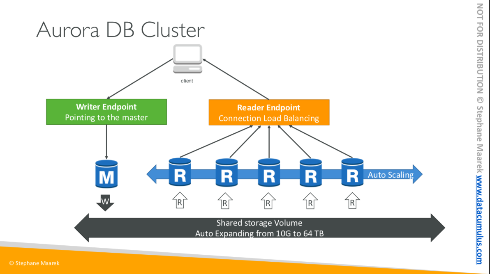

# AWS Note

## TODOs

* Hands On
  * ALB (34)
  * EBS (44)
  * EFS (48)
* Review lecture PDF
* Mock exam

## Basics

* AWS Availability Zones (AZ) - Geographically-isolated (but connected) data centers
* Check [Region Table](https://aws.amazon.com/about-aws/global-infrastructure/regional-product-services/?p=ngi&loc=4) if the service you want to use is not supported in your current region.

-----

## IAM, Identity and Access Management (Global Service)

IAM allows you to manage users and their levels of access to AWS console

* IAM is universal. It does not apply to regions
* IAM role: a secure way to grant permissions to entities (users, groups or services) that you trust
* IAM policy: a JSON document which defines one or more permissions

* IAM Federation - Enterprises integrate their own repository of users with IAM using SAML standard (Active Directory)
* MFA (Multi Factor Authentication) can be setup (e.g. Google Authenticator app)
* **Least Privilege Principle**: It's best to give users the minimal amount of permissions they need to perform their jobs
* Always create groups then assign your users to that group
* Basic rule: 1 IAM user for 1 person; 1 IAM role for 1 application
* Security group: virtual firewall to allow traffic in and out to your instance

-----

## EC2, Elastic Compute Cloud (Reginal Service)

EC2 is a web service that provides resizable compute capacity in the cloud (virtual machine in the cloud)

### EC2 Instance Types

1. On Demand
    * allows you to pay a fixed rate by the hour (or second)
    * Use cases:
      * applications with short term, spiky or unpredictable workloads
      * applications being developed or tested on EC2

2. Reserved
    * capacity reservation (1 or 3 year terms)
    * Use cases:
      * application with steady state or predictable usage (e.g. web servers)
    * Instance Types
      * Reserved Instances
      * Convertable Reserved Instances
      * Scheduled Reserved Instances - launch within the time window

3. Spot
    * **bid** whatever price you want for instance capacity (less reliable)
    * Use cases:
      * applications that have flexible start and end times
      * users with an urgent need for large amount of addtional computing capacity

4. Dedicated Hosts
    * an entire physical server dedicated for your use (BYOL, Bring Your Own License)
    * can be purchased on demand
    * Use cases:
      * useful for regulatory requirements that may not support multi-tenant virtualization or cloud deployments

How to remember it? -> Fight Dr McPX
F - FPGA  
I - IOPS  
G - Graphics  
H - High Disk Throughput  
T - Cheap general purpose  
D - Density  
R - RAM  
M - Main choice for general purpose apps  
C - Compute  
P - Graphics  
X - Extreme Memory  

### EC2 Lab

#### SSH into EC2 instance

1. Copy the public IP of your instance
2. `chmod 0400 your_key.pem` (needed to solve **permission error exception**)
3. `ssh -i your_key.pem ec2-user@your_public_ip` (Use `logout` to logout)

#### Turn your Linux server into a web server through Apache

1. SSH into the instance
2. `sudo su` to switch to root account
3. `yum update -y` to update the operating system
4. `yum install httpd -y` to install Apache
5. `service httpd start` or `systemctl start httpd.service` to start server
6. `chkconfig httpd on` or `systemctl enable httpd.service` to make Apache come on automatically after reboot
7. `service httpd status` or `systemctl status httpd.service` to check if Apache server is running
8. `cd /var/www/html/` to check the root dir of web server
9. `nano index.html` and add `<html><body><h1>Hello Cloud Gurus!</h1></body></html>`
10. Now you can access to this newly created index.html from the public IP

-----

## EBS, Elastic Block Store

You can think EC2 is a virtual server in the cloud, and EBS is a **virtual disk**. EBS allows you to create storage volumes and attach them to EC2 instances. EBS volumes are placed in **specific AZ**

### 4 EBS Volume Types

EBS volumes are characterized in size, throughput, IOPS (I/O Ops Per Sec). Here are 4  EBS Volume Types:

1. General Purpose SSB, GP2
    * General purpose SSD volume that balances price and performance for a wide variety of workloads
    * Ratio of **3 IOPS/GB** with up to 10,000 IOPS and the ability to burst up to 3000 IOPS for extended period of time for volumes at 3334 GB andabove (Suitable for applications with less than 1000 IOPS -> best performace and price)

2. Provisioned IOPS SSD, IO1
    * Designed for I/O intensive applications such as large relational or NoSQL databases
    * Use if you need more than 10,000 IOPS
    * Can provision up to 20,000 IOPS per volume

3. Throughput Optimized HDD, ST1
    * Cannot be a boot volume
    * Use cases: big data, data warehouses, log processing, Apache Kafka
    * Max IOPS: 500
    * Max throughput: 500 MB/s

4. Cold HDD, SC1
    * Lowest cost storage for **infrequently** accessed workloads
    * Cannot be a boot volume
    * Use case: file server
    * Max IOPS: 250
    * Max throughput: 250 MB/s

5. Magnetic (Legacy)
    * Lowest cost per gigabyte of all EBS volume types that is bootable
    * Use case: infrequently accessed data + lowest storage cost is important

### EBS Lab

If you create an EBS volume from an encrypted snapshot, the volume will automatically be encrypted, vice versa

#### How to create and attach an EBS Volume to EC2

1. Create an encrypted EBS volume (remember to check the AZ which should be the same as your instance) and attach it to you instance
2. SSH into the instance ans switch to root account `sudo su`
3. Use `lsblk` to show all volumes
4. Use `file -s /dev/xvdf` to check. "/dev/xvdf: data" means no data on the volume, so it's ok to create a file system
5. Create a file system `mkfs -t ext4 /dev/xvdf`
6. Create a folder `mkdir /filesystem` and mount it `mount /dev/xvdf /filesystem/`
7. Use `lsblk` to check if it's mounted
8. Use `umount -d /dev/xvdf`

#### How to encrypt an EBS Volume attached to EC2

1. Detach the volume from instance
2. Create a snapshot of the volume
3. Delete the volume
4. Create a volume from the snapshot (Under EBS/Snapshots)
5. Attach the newly created volume to EC2 instance
6. Mount the volume to dir `mount /dev/xvdf /filesystem`
7. Now you can see your old files `ls /filesystem`

#### Create an encrypted snapshot of the root volume

1. Create a snapshot of the volume
2. Copy the snapshot with encryption
3. Create an image from the new encrypted snapshot
4. Launch an instance from the image

-----

## AMI, Amazon Machine Image

* An image to use to create our instances (e.g. Amazon Linux 2)
* AMIs can be built for Linux or Windows machines
* **AMIs are built for a specific AWS region**

-----

## ELB, Elastic Load Balancers

Load balancers help us balance our load across multiple different servers

### 3 types of load balancer

1. Application Load Balancer
    * best suited for HTTP and HTTPS traffic
    * operating at Layer 7
    * application-aware

2. Network Load Balancer
    * Best suited for TCP traffic where extreme performance is required (handiling millions of requests per second)
    * low latency
    * operating at the connection level (Layer 4)

3. Classic Load Balancer (legacy)
    * Layer 7 (HTTP, HTTPS) and Layer 4 (TCP)
    * X-forwarded
    * Sticky sessions

### Load balancer errors

If your application stops responding, the CLB responsed with a 504 error (gateway timeout error). The issue could be at either web server layer or database layer. CLB will identify where the application is falling and scale it up or out if possible

### X-Forwarded-For header

When the instance wants to get the client IP (the IPv4 address of your end user) but only get private IP of load balancer, it can get the client IP from X-Forwarded-For header

-----

## RDS

### OLTP v.s. OLAP

Online Transaction Processing (OLTP) differs from Online Analytics Processing (OLAP) in terms of the types of queries you will run (e.g. OLTP - insertion, OLAP - calculate the net profit of a product)

### AWS Database Types

* RDS - OLTP (MySQL, PostgreSQL, Oracle, Aurora, MariaDB)
* DynamoDB - NoSQL
* RedShift - OLAP (big data)
* Elasticache - In memory caching (Memcached, Redis)

### Backups, Multi-AZ and Read Replicas

* There're 2 types of backups for AWS:
  1. Automated backups
      * enabled by default
      * recover your database to any point within a retention period (1~35 days)
      * It allows you to do a point in time recovery down to a second
      * The backup is stored in S3 (you get free space = the size of db)
      * Backups are taken within a defined backup window. Storage I/O may be suspended and you may experience elevated latency
  2. Database snapshots
      * done manually
      * DB snapshots are stored after you delete the original RDS instance, unlike automated backups
* Restored version of the database will be a new RDS instance with a new DNS endpoint

* Multi-AZ: Each RDS database has a exact copy (synchornously replicated) in a different AZ **for disaster recovery** only. The failover (of RDS DNS endppint) is automatically

* Read Replica (**for performance/ scailing**)
  * Assume 90% traffic is read traffic
  * Read replicas allow you to have a read-only copy of the production database
  * Using asynchronous replication from the primary RDS instance to the read replica
  * You can have up to 5 read replicas of any database
  * You can have a read replicain another region
  * You can promote read replicas to databases (the replication will be broken)

### RDS Lab

#### Connect EC2 instance to RDS instance

1. Create a RDS database
2. Launch a new instance with bootstrape script

        #!/bin/bash  
        yum install httpd php php-mysql -y  
        yum update -y  
        chkconfig httpd on  
        service httpd start  
        echo "<?php phpinfo();?>" > /var/www/html/index.php
        cd /var/www/html  
        wget https://s3.amazonaws.com/acloudguru-production/connect.php

3. SSH into the instance and go to /var/www/html
4. Paste the endpoint of your RDS database to $hostname of connect.php
5. Add inbound rule to the RDS security group for instance traffic
    * Type: MySQL/Aurora
    * Port: 3306
    * Source: security group of the instance
6. Browse public_ip/connect.php

-----

## Elasticache (for read-heavy applications)

Scenarios:

* Memcached
  * object caching is your primary goal
  * keep things as simple as possible
  * running large cache nodes
  * multithreaded/ multiple cores
  * horizontally scale your cache

* Redis
  * more advanced data types (list, hash, set)
  * sorting and ranking
  * data persistent
  * Multi-AZ
  * pub/sub capailities are needed

-----

## Route53 (Amazon's DNS Service)

Route53 allows you to:

* Register domain names
* [Create record sets by types](https://docs.aws.amazon.com/Route53/latest/DeveloperGuide/ResourceRecordTypes.html)
* Map your domain names to EC2 instances, load balancers, S3 buckets

-----

## S3

* [AWS CLI Command Reference](https://docs.aws.amazon.com/cli/latest/index.html)

### S3 Lab

#### Connect to AWS S3 from instance using Access Key ID

1. SSH into an instance
2. `aws configure` and use user's Access Key ID and Secret Access Key
3. Create a bucket `aws s3 mb s3://acloudguru1234-xxxx`
4. Test with `aws s3 ls`
5. `echo "hello" > hello.txt`
6. `aws s3 cp hello.txt s3://acloudguru1234-xxxx`
7. `aws s3 ls s3://acloudguru1234-xxxx`

#### Connect to AWS S3 from instance using IAM role (preferred from a security perspective)

IAM roles allow you not to user Access Key IDs and Secret Access Keys

1. Create an IAM role for S3 full access
2. Instance/Instance Settings/Attach IAM Role
3. SSH into the instance
4. (optional) Remove old configs by `rm ~/.aws/config` and `rm ~/.aws/credentials`
5. Test with `aws s3 ls`

-----

### VPC

Virtual cloud data center

-----

(old notes)

* It mainly consists in the capability of:
  * Renting virtual machines (EC2)
  * Storing data in virtual drives (EBS)
  * Distributing load across machines (ELB)
  * Scaling the services using an auto-scaling group (ASG)

### Security Groups

* Security groups are acting as a "firewall" on EC2 instances.
* The relationship between security groups and instances is N-to-N.
* Security groups are locked down to a region/VPC combination. i.e. If you switch region, you'll need to create a new security group.
* It live outside the EC2 - if traffic is blocked, the EC2 instance won't see it.
* It's good to maintain 1 seperate security group for SSH access.
* By default, all inbound traffic is blocked and all outbound traffic is authorised.

### Private v.s. Public v.s. Elastic IP

* Networking has 2 sorts of IPs
  * IPv4: 1.160.10.240 (the most common format used online)
  * IPv6: 3ffe: 1900:4545:3:200:f8ff:fe21:67cf (newer, for IoT)

* Public IP
  * The machine can be identified on the internet (WWW).
  * Must be unique across the whole web.
  * Can be geo-located easily
* Private IP
  * The machine can only be identified on a private network.
  * Must be unique across the private network.
  * Machines connect to WWW using a NAT device + internet gateway (a proxy)
  * Only a specified range of IPs can be used as private IPs.
* Elastic IP
  * Basically when you restart an ECs instance, it can change its public IP. If you need to have a fixed public IP for your instance, you need an Elastic IP.
  * An Elastic IP is a public IPv4 IP you own as long as you don't delete it.
  * You can attach it to only 1 instance at a time.
  * You can only have 5 Elastic IP in your account (could ask AWS to increase that).
  * Overall, try to avoid using Elastic IP. Use a random public IP and register a DNS name to it. (more scalable), or use a Load Balancer.

### EC2 User Data

* You could boostrap your instances using an EC2 User Data script, which will only run once at the instance first start.
* EC2 user data is used to automate boot tasks (installing updates, installing softwares, downloading common files...etc).
* EC2 user data script runs with the root user.
* Add EC2 user data script at step 3 (Configure Instance) of Launch instance/Advanced Details

    #!/bin/bash
    yum update -y
    yum install -y httpd.x86_64
    systemctl start httpd.service
    systemctl enable httpd.service
    echo "Hello World from $(hostname -f)" > /var/www/html/index.html

### ENI, Elastic Network Interfaces

* Logical component in a VPC that represents a virtual network card
* You can create ENI independently and attach them on EC2 instances
* Each ENI can have:
  * Primary private IPv4, one or more secondary IPv4
  * One Elastic IP (IPv4) per private IPv4
  * One public IPv4
  * One or more security groups
  * A MAC address
* Bound to specific availability zone (AZ)

-----

### EBS

#### EBS v.s. Instance Store

* Some instance doesn't come with Root EBS volumes, instead they come with instance store (ephemeral storage)
* Instance store is physically attached to the machine, whereas EBS is a network drive
* Pros of instance store:
  * Better I/O performance (very high IOPS)
  * Good for buffer/cache/scratch data/temporary content
  * Data survives reboot
  * Disk up to 7.5 GB, stripped to reach 30 GB
* Cons:
  * On stop or termination, the instance store is lost
  * You can't resize the instance store
  * Backups must be operated by the user
  * Cannot be increased in size

#### [EBS Hands on](https://docs.aws.amazon.com/AWSEC2/latest/UserGuide/ebs-using-volumes.html)

1. SSH into the instance
2. `lsblk` will list all attached drives
3. `sudo file -s /dev/nvme1n1` gets information about a device
4. `sudo mkfs -t ext4 /dev/nvme1n1` creates a file system on the volume
5. `sudo mkdir /data` creates a mount point directory for the volume. The mount point is where the volume is located in the file system tree and where you read and write files to after you mount the volume
6. `sudo mount /dev/nvme1n1 /data` mounts the volume at the directory you created
7. Test with `sudo touch hello.txt`
8. To mount an attached volume automatically after reboot
    * `sudo cp /etc/fstab /etc/fstab.orig`
    * `sudo nano /etc/fstab`
    * Add this line: `/dev/nvme1n1	/data	ext4	defaults,nofail	0 2`
9. Check by `sudo file -s /dev/nvme1n1`
10. Unmount data `sudo umount /data`
11. Mount data `sudo mount /data`

## ELB, EC2 Load Balancer

* High availability
  * High availability means running your application/system in at least 2 data centers (AZ).
  * The goal is to survive a data center loss.

* You can setup internal(private) or external(public) ELBs.

* AWS has 3 types of manages load balancer
  1. Classic Load Balancer (v1 - old generation), 2009
      * Supports TCP (layer 4), HTTP, HTTPS (layer 7)
      * Health checks are TCP ot HTTP based.
      * Fixed hostname (xxx.region.elb.amazonaws.com)

  2. Application Load Balancer (v2 - new generation), Layer 7 , 2016
      * Support HTTP, HTTPS, WebSocket
      * Support redirects (e.g. HTTP to HTTPS)
      * Routing tables to different **target groups** based on:
        * Path in URL (e.g. /users and /search)
        * Hostname in URL
        * Query strings and headers
      * Target groups could be:
        * EC2 instances (can be managed by an Auto Scailing Group) - HTTP
        * ECS tasks (managed by ECS itself) - HTTP
        * Lambda functions - HTTP requests is translated into a JSON event
        * IP Addresses (must be private IPs)
      * ALB can route to multiple target groups. Health checks are at the target group level.
      * ALB is a great fit for micro services & container-based applications (e.g. Docker, Amazon EC2)
      * Has a port mapping feature to redirect to a dynamic port in ECS
      * Fixed hostname (xxx.region.elb.amazonaws.com)
      * The application servers don't see the IP of client directly. The true IP of the client is inserted in the header X-Forwarded-For

  3. Network Load Balancer (v2 - new generation), Layer 4, 2017 (not included in free tier)
      * Supports TCP, TLS (Secure TCP), UDP
      * Handle millions of request per second
      * Less latency ~ 100 ms (400 ms for ALB)
      * NLB has **1 static IP per AZ** and supports assigning Elastic IP. **Network Load Balancers expose a public static IP, whereas an Application or Classic Load Balancer exposes a static DNS (URL).**
      * NLBs are used for extreme performance, TCP/UDP level traffic

* Load Balancer Stickness
  * Stickness: the same client is always redirected to the same instance behind a load balancer
  * It works to CLB and ALB
  * The cookie used for stickness has an expiration date you control
  * Enabling stickness may bring imbalance to the load over the backend EC2 instances

* Cross-Zone Load Balancing
  * Each load balancer instance distributes evenly across all registered instances in all AZ
  * CLB - Disabled by default, free to enable
  * ALB - Always on (cannot be disabled), free
  * NLB - Disabled by default, cost needed

* SSL/TLS Basics
  * SSL refers to Secure Socket Layer, used to encrypted connections
  * TLS refers to Transport Layer Security, which is newer version
  * A SSL certificate allows traffic between your clients and your load balancer to be ecrypted in transit (in-flight encryption)
  * Public SSL certificates are issued by Certificate Authorities (CA)
  * SSL certificates have an expiration date (you set) and must be renewed

* SNI, Server Name Indication
  * SNI solves the problem of loading multiple SSL certificates onto one web server (to server multiple websites)
  * SNI is a newer protocal and requires the client to indicate the hostname of the target server in the initial SSL handshake. The server will find the correct certificate or return the default one
  * SNI only works for ALB, NLB, CloudFront

* SSL Certificates
  * CLBs support only 1 SSL certificate. Must use multiple CLBs for hostnames with multiple SSL certificates
  * ALBs/NLBs support multiple listeners with multiple SSL certificates and use SNI to make it work

* Connection Draining (Deregistration Delay)
  * It's the time to complete "in-flight requests" while the instance is de-registering or unhealthy
  * ELB will stop sending new requests to the instance which is de-registering
  * Deregistration Delay will be 300 seconds by default (can be set from 0 (disabled) to 3600 seconds)

## ASG, Auto Scailing Groups

* The goal of ASG is to:
  * Scale out (add EC2 instances) to match an increased load
  * Scale in (remove EC2 instances) to match decreased load
  * Automatically register new instances to load balancer

* ASG will scale based on CloudWatch alarms
  * An alarm monitors a metric (such as average CPU)

* Types of Scailing Policies
  1. Target Tracking Scailing (e.g. the **average** ASG CPU to stay at around 40%)
  2. Simple/Step Scailing: When a **CloudWatch alarm** is triggered (e.g. CPU > 70%), add 2 units. When a CloudWatch alarm is triggered (e.g. CPU < 30%), remove 1 unit.
  3. Scheduled Action
      * Anticipte a scailing based on known usage patterns
      * e.g. increase the min capacity to 10 at 5 pm on Fridays

* Scailing Cooldowns
  * The cooldown period ensures that ASG group doesn't launch or terminate additional instances before previous scailing activity takes effect.
  * Cooldowns can be customised to a specific **simple scailing policy**.

-----

## EFS, Elastic File System

Managed NFS (Network File System) that can be mounted on many EC2 instances **across AZ**.

* Use cases: content management, web serving, data sharing, WordPress
* Use NFSv4.1 protocol (for inbound rules)
* Use security groups to control access to EFS
* Compatible with Linux based AMI only
* Encryption at rest using KMS
* POSIX file system that has a standard file API
* 1000s of concurrent NFS clients, 10 GB+/s throughput
* Grow to PB-scale network file system automatically

### Performance  modes

1. General purpose (default): latency-sensitive use cases (web server, CMS..)
2. Max I/O: higher latancy, throughput, highly parallel (big data, media processing)

### Storage Tiers

Storage Tiers (lifecycle management feature - move from from tier to tier after N days)

1. Standard: for frequently accessed files
2. Infrequently access (EFS-IA): cost to retrive files, lower price to store

### EBS v.s. EFS

* EBS volumes
  * Can be attached to only one instance at a time
  * Are locked at the AZ level
  * GP2: IO increases if the disk size increases
  * IO1: can increase IO independently
  * To migrate an EBS volume across AZ
    * Take a snapshot
    * Restore the snapshot to another AZ
    * EBS backups use IO and you shouldn’t run them while your application is handling a lot of traffic
  * Root EBS Volumes of instances get terminated by default if the EC2 instance gets terminated. (you can disable that)

* EFS
  * Mounting 100s of instances across AZ
  * EFS share website files (WordPress)
  * Only for Linux Instances (POSIX)
  * EFS has a higher price point than EBS
  * Can leverage EFS-IA for cost savings

-----

## RDS, Relational Database Service

* Advantage over using RDS versus deploying DB on EC2: RDS is a managed service, so AWS provides some other services you can use along with AWS RDS, such as:
  * Automated provisioning, OS patching
  * Continuous backups and restore to specific timestamp (Point in Time Restore)!
  * Monitoring dashboards
  * Read replicas for improved read performance
  * Multi AZ setup for DR (Disaster Recovery)
  * Maintenance windows for upgrades
  * Scaling capability (vertical and horizontal) * Storage backed by EBS (gp2 or io1)
* However, you can’t SSH into your RDS instances

### RDS Backups

* Backups are automatically enabled in RDS

* Automated backups:
  * **Daily** full backup of the database (during the maintenance window)
  * Transaction logs are backed-up by RDS every **5 minutes**
  * => ability to restore to any point in time (from oldest backup to 5 minutes ago) * 7 days retention (can be increased to 35 days)

* DB Snapshots:
  * Manually triggered by the user
  * Retention of backup for as long as you want

### RDS Read Replicas

* Up to 5 Read Replicas
* Within AZ, Cross AZ Application or Cross Region
* Replication is ASYNC, so reads are eventually consistent (You might get old data if request before replication)
* Replicas can be promoted to their own DB
* Applications must update the connection string to leverage read replicas
* Read replicas are used for **SELECT (=read) only** kind of statements (not INSERT, UPDATE, DELETE)

* Use cases:
  * You have a production database that is taking on normal load
  * You want to run a reporting application to run some analytics
  * You create a Read Replica to run the new workload there
  * The production application is unaffected

* Network Cost
  * In AWS there’s a network cost when data goes from one AZ to another
  * To reduce the cost, you can have your Read Replicas in the same AZ (free)

### RDS Multi AZ (Disaster Recovery)

* **SYNC** replication
* One DNS name – automatic app failover to standby
* Increase availability
* Failover in case of loss of AZ, loss of network, instance or storage failure
* No manual intervention in apps
* Not used for scaling
* The Read Replicas be setup as Multi AZ for Disaster Recovery (DR)

### RDS Security

#### 2 Encryption Types

1. At rest encryption
    * Possibility to encrypt the master & read replicas with AWS KMS - AES-256 encryption
    * Encryption has to be defined at launch time
    * If the master is not encrypted, the read replicas cannot be encrypted
    * Transparent Data Encryption (TDE) available for Oracle and SQL Server

2. In-flight encryption
    * SSL certificates to encrypt data to RDS in flight
    * Provide SSL options with trust certificate when connecting to database * To enforce SSL:
      * PostgreSQL: `rds.force_ssl=1` in the AWS RDS Console (Parameter Groups)
      * MySQL: (Within the DB) `GRANT USAGE ON *.* TO 'mysqluser'@'%' REQUIRE SSL;`

#### RDS Encryption Operations

Encrypting RDS backups

* Snapshots of un-encrypted RDS databases are un-encrypted
* Snapshots of encrypted RDS databases are encrypted
* Can copy a snapshot into an encrypted one

To encrypt an un-encrypted RDS database:

1. Create a snapshot of the un-encrypted database
2. Copy the snapshot and enable encryption for the snapshot
3. Restore the database from the encrypted snapshot
4. Migrate applications to the new database, and delete the old database

#### Network Security

* RDS databases are usually deployed within a private subnet, not in a public one
* RDS security works by leveraging security groups (the same concept as for EC2 instances) – it controls which IP / security group can communicate with RDS

#### Access Management

* IAM policies help control who can manage AWS RDS (through the RDS API)
* Traditional Username and Password can be used to login into the database
* IAM-based authentication can be used to login into **RDS MySQL & PostgreSQL**

* IAM Authentication
  * IAM database authentication works with MySQL & PostgreSQL
  * You don’t need a password, just an authentication token obtained through IAM & RDS API calls
  * Auth token has a lifetime of 15 minutes
  * Benefits:
    * Network in/out must be encrypted using SSL
    * IAM to centrally manage users instead of DB
    * Can leverage IAM Roles and EC2 Instance profiles for easy integration

## Aurora

* Aurora is a proprietary technology from AWS (not open sourced)
* Postgres and MySQL are both supported as Aurora DB (that means your drivers will work as if Aurora was a Postgres or MySQL database)
* Aurora is "AWS cloud optimized" and claims 5x performance improvement over MySQL on RDS, over 3x the performance of Postgres on RDS
* Aurora storage automatically grows in increments of 10GB, up to 64 TB (Auto expanding, shared storage volume)
* Aurora can have 15 replicas while MySQL has 5, and the replication process
is faster (sub 10 ms replica lag)
* Failover in Aurora is instantaneous. It’s HA (High Availability) native.
* Aurora costs more than RDS (20% more) – but is more efficient

### Aurora High Availability and Read Scaling

* 6 copies of your data across 3 AZ:
  * 4 copies out of 6 needed for writes
  * 3 copies out of 6 need for reads
  * Self healing with peer-to-peer replication
  * Storage is striped across 100s of volumes
* One Aurora Instance takes writes (master). Automated failover for master in less than 30 seconds
* Master + up to 15 Aurora Read Replicas serve reads
* Support for Cross Region Replication

### Aurora DB Cluster

### Aurora Security

* Similar to RDS because uses the same engines
* Encryption at rest using KMS (Key Management Service)
* Automated backups, snapshots and replicas are also encrypted
* Encryption in flight using SSL (same process as MySQL or Postgres)
* Possibility to authenticate using IAM token (same method as RDS)
* You are responsible for protecting the instance with security groups 
* You can’t SSH

### Aurora Serverless

* Automated database instantiation and auto-scaling based on actual usage
* Good for **infrequent, intermittent or unpredictable workloads**
* No capacity planning needed
* Pay per second, can be more cost-effective

### Global Aurora

Aurora Cross Region Read Replicas:

* Useful for disaster recovery
* Simple to put in place

Aurora Global Database (recommended):

* 1 Primary Region (read / write)
* Up to 5 secondary (read-only) regions, replication lag is less than 1 second
* Up to 16 Read Replicas per secondary region
* Helps for decreasing latency
* Promoting another region (for disaster recovery) has an RTO of < 1 minute

## ElasticCache

* ElastiCache is to get managed Redis or Memcached
* Caches are in-memory databases with really high performance, low latency
* Helps reduce load off of databases for read intensive workloads
* Helps make your application stateless
* AWS takes care of OS maintenance / patching, optimizations, setup, configuration, monitoring, failure recovery and backups
* Using ElastiCache involves heavy application code changes

-----
