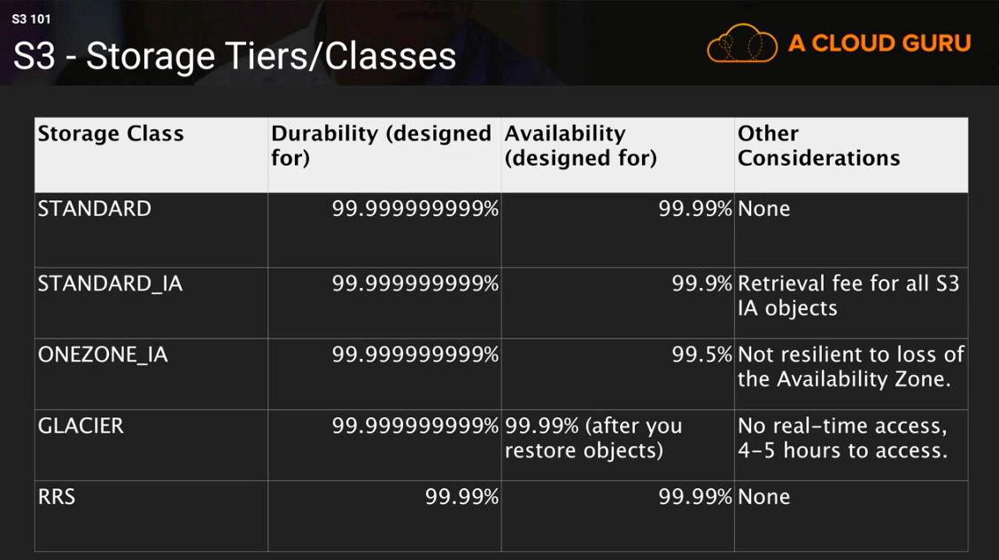

# AWS Note

## TODOs

* Lab
  * CORS
  * Make an Alexa Skill Lab

* To Read
  * [Choosing the Right DynamoDB Partition Key](https://aws.amazon.com/tw/blogs/database/choosing-the-right-dynamodb-partition-key/)

* Review AWS FAQs
  * [Lambda](https://aws.amazon.com/lambda/faqs/?nc1=h_ls)
  * [S3 FAQs](https://aws.amazon.com/tw/s3/faqs/)

* Review lecture PDF and notes
* Review Guru comments
* Mock exam

* Suggestions
  * Share Lecture PDF
  * Lab
    * Tell the users in the beginning that if the following lab will cost them any amount of money

## Basics

* AWS Availability Zones (AZ) - Geographically-isolated (but connected) data centers
* Check [Region Table](https://aws.amazon.com/about-aws/global-infrastructure/regional-product-services/?p=ngi&loc=4) if the service you want to use is not supported in your current region.

-----

## IAM, Identity and Access Management (Global Service)

IAM allows you to manage users and their levels of access to AWS console

* IAM is universal. It does not apply to regions
* IAM role: a secure way to grant permissions to entities (users, groups or services) that you trust
* IAM policy: a JSON document which defines one or more permissions

* IAM Federation - Enterprises integrate their own repository of users with IAM using SAML standard (Active Directory)
* MFA (Multi Factor Authentication) can be setup (e.g. Google Authenticator app)
* **Least Privilege Principle**: It's best to give users the minimal amount of permissions they need to perform their jobs
* Always create groups then assign your users to that group
* Basic rule: 1 IAM user for 1 person; 1 IAM role for 1 application
* Security group: virtual firewall to allow traffic in and out to your instance

-----

## EC2, Elastic Compute Cloud (Reginal Service)

EC2 is a web service that provides resizable compute capacity in the cloud (virtual machine in the cloud)

### EC2 Instance Types

1. On Demand
    * allows you to pay a fixed rate by the hour (or second)
    * Use cases:
      * applications with short term, spiky or unpredictable workloads
      * applications being developed or tested on EC2

2. Reserved
    * capacity reservation (1 or 3 year terms)
    * Use cases:
      * application with steady state or predictable usage (e.g. web servers)
    * Instance Types
      * Reserved Instances
      * Convertable Reserved Instances
      * Scheduled Reserved Instances - launch within the time window

3. Spot
    * **bid** whatever price you want for instance capacity (less reliable)
    * Use cases:
      * applications that have flexible start and end times
      * users with an urgent need for large amount of addtional computing capacity

4. Dedicated Hosts
    * an entire physical server dedicated for your use (BYOL, Bring Your Own License)
    * can be purchased on demand
    * Use cases:
      * useful for regulatory requirements that may not support multi-tenant virtualization or cloud deployments

How to remember it? -> Fight Dr McPX
F - FPGA  
I - IOPS  
G - Graphics  
H - High Disk Throughput  
T - Cheap general purpose  
D - Density  
R - RAM  
M - Main choice for general purpose apps  
C - Compute  
P - Graphics  
X - Extreme Memory  

### EC2 Lab

#### SSH into EC2 instance

1. Copy the public IP of your instance
2. `chmod 0400 your_key.pem` (needed to solve **permission error exception**)
3. `ssh -i your_key.pem ec2-user@your_public_ip` (Use `logout` to logout)

#### Turn your Linux server into a web server through Apache

1. SSH into the instance
2. `sudo su` to switch to root account
3. `yum update -y` to update the operating system
4. `yum install httpd -y` to install Apache
5. `service httpd start` or `systemctl start httpd.service` to start server
6. `chkconfig httpd on` or `systemctl enable httpd.service` to make Apache come on automatically after reboot
7. `service httpd status` or `systemctl status httpd.service` to check if Apache server is running
8. `cd /var/www/html/` to check the root dir of web server
9. `nano index.html` and add `<html><body><h1>Hello Cloud Gurus!</h1></body></html>`
10. Now you can access to this newly created index.html from the public IP

-----

## EBS, Elastic Block Store

You can think EC2 is a virtual server in the cloud, and EBS is a **virtual disk**. EBS allows you to create storage volumes and attach them to EC2 instances. EBS volumes are placed in **specific AZ**

### 4 EBS Volume Types

EBS volumes are characterized in size, throughput, IOPS (I/O Ops Per Sec). Here are 4  EBS Volume Types:

1. General Purpose SSB, GP2
    * General purpose SSD volume that balances price and performance for a wide variety of workloads
    * Ratio of **3 IOPS/GB** with up to 10,000 IOPS and the ability to burst up to 3000 IOPS for extended period of time for volumes at 3334 GB andabove (Suitable for applications with less than 1000 IOPS -> best performace and price)

2. Provisioned IOPS SSD, IO1
    * Designed for I/O intensive applications such as large relational or NoSQL databases
    * Use if you need more than 10,000 IOPS
    * Can provision up to 20,000 IOPS per volume

3. Throughput Optimized HDD, ST1
    * Cannot be a boot volume
    * Use cases: big data, data warehouses, log processing, Apache Kafka
    * Max IOPS: 500
    * Max throughput: 500 MB/s

4. Cold HDD, SC1
    * Lowest cost storage for **infrequently** accessed workloads
    * Cannot be a boot volume
    * Use case: file server
    * Max IOPS: 250
    * Max throughput: 250 MB/s

5. Magnetic (Legacy)
    * Lowest cost per gigabyte of all EBS volume types that is bootable
    * Use case: infrequently accessed data + lowest storage cost is important

### EBS Lab

If you create an EBS volume from an encrypted snapshot, the volume will automatically be encrypted, vice versa

#### How to create and attach an EBS Volume to EC2

1. Create an encrypted EBS volume (remember to check the AZ which should be the same as your instance) and attach it to you instance
2. SSH into the instance ans switch to root account `sudo su`
3. Use `lsblk` to show all volumes
4. Use `file -s /dev/xvdf` to check. "/dev/xvdf: data" means no data on the volume, so it's ok to create a file system
5. Create a file system `mkfs -t ext4 /dev/xvdf`
6. Create a folder `mkdir /filesystem` and mount it `mount /dev/xvdf /filesystem/`
7. Use `lsblk` to check if it's mounted
8. Use `umount -d /dev/xvdf`

#### How to encrypt an EBS Volume attached to EC2

1. Detach the volume from instance
2. Create a snapshot of the volume
3. Delete the volume
4. Create a volume from the snapshot (Under EBS/Snapshots)
5. Attach the newly created volume to EC2 instance
6. Mount the volume to dir `mount /dev/xvdf /filesystem`
7. Now you can see your old files `ls /filesystem`

#### Create an encrypted snapshot of the root volume

1. Create a snapshot of the volume
2. Copy the snapshot with encryption
3. Create an image from the new encrypted snapshot
4. Launch an instance from the image

-----

## AMI, Amazon Machine Image

* An image to use to create our instances (e.g. Amazon Linux 2)
* AMIs can be built for Linux or Windows machines
* **AMIs are built for a specific AWS region**

-----

## ELB, Elastic Load Balancers

Load balancers help us balance our load across multiple different servers

### 3 types of load balancer

1. Application Load Balancer
    * best suited for HTTP and HTTPS traffic
    * operating at Layer 7
    * application-aware

2. Network Load Balancer
    * Best suited for TCP traffic where extreme performance is required (handiling millions of requests per second)
    * low latency
    * operating at the connection level (Layer 4)

3. Classic Load Balancer (legacy)
    * Layer 7 (HTTP, HTTPS) and Layer 4 (TCP)
    * X-forwarded
    * Sticky sessions

### Load balancer errors

If your application stops responding, the CLB responsed with a 504 error (gateway timeout error). The issue could be at either web server layer or database layer. CLB will identify where the application is falling and scale it up or out if possible

### X-Forwarded-For header

When the instance wants to get the client IP (the IPv4 address of your end user) but only get private IP of load balancer, it can get the client IP from X-Forwarded-For header

-----

## RDS

### OLTP v.s. OLAP

Online Transaction Processing (OLTP) differs from Online Analytics Processing (OLAP) in terms of the types of queries you will run (e.g. OLTP - insertion, OLAP - calculate the net profit of a product)

### AWS Database Types

* RDS - OLTP (MySQL, PostgreSQL, Oracle, Aurora, MariaDB)
* DynamoDB - NoSQL
* RedShift - OLAP (big data)
* Elasticache - In memory caching (Memcached, Redis)

### Backups, Multi-AZ and Read Replicas

* There're 2 types of backups for AWS:
  1. Automated backups
      * enabled by default
      * recover your database to any point within a retention period (1~35 days)
      * It allows you to do a point in time recovery down to a second
      * The backup is stored in S3 (you get free space = the size of db)
      * Backups are taken within a defined backup window. Storage I/O may be suspended and you may experience elevated latency
  2. Database snapshots
      * done manually
      * DB snapshots are stored after you delete the original RDS instance, unlike automated backups
* Restored version of the database will be a new RDS instance with a new DNS endpoint

* Multi-AZ: Each RDS database has a exact copy (synchornously replicated) in a different AZ **for disaster recovery** only. The failover (of RDS DNS endppint) is automatically

* Read Replica (**for performance/ scailing**)
  * Assume 90% traffic is read traffic
  * Read replicas allow you to have a read-only copy of the production database
  * Using asynchronous replication from the primary RDS instance to the read replica
  * You can have up to 5 read replicas of any database
  * You can have a read replicain another region
  * You can promote read replicas to databases (the replication will be broken)

### RDS Lab

#### Connect EC2 instance to RDS instance

1. Create a RDS database
2. Launch a new instance with bootstrape script

        #!/bin/bash  
        yum install httpd php php-mysql -y  
        yum update -y  
        chkconfig httpd on  
        service httpd start  
        echo "<?php phpinfo();?>" > /var/www/html/index.php
        cd /var/www/html  
        wget https://s3.amazonaws.com/acloudguru-production/connect.php

3. SSH into the instance and go to /var/www/html
4. Paste the endpoint of your RDS database to $hostname of connect.php
5. Add inbound rule to the RDS security group for instance traffic
    * Type: MySQL/Aurora
    * Port: 3306
    * Source: security group of the instance
6. Browse public_ip/connect.php

-----

## Elasticache

* Elasticache: in-memory cache in the cloud
* In general, Elasticache is for RDS and DAX is for DynamoDB

### 2 types of Elasticache

* Memcached
  * **object caching**
  * keep things as simple as possible
  * running large cache nodes
  * multithreaded/ multiple cores
  * horizontally scale your cache
  * Not Multi-AZ

* Redis
  * **key-value store** and more complicated data structures like set and list
  * sorting and ranking
  * data persistent
  * Multi-AZ
  * supports Master/Slace application
  * pub/sub capailities are needed

### 2 caching strategies available

* Lazy Loading
  * loads the data into cache only when necessary
  * returns null if the result is not in the cache, then fetch it from database for the next query
  * Problem - Stale data (data in cache won't be updated while the data in database is updated)
    * Solution - add TTL (Time To Live) to data
    * Specify the number of seconds until the key expires to avoid keeping stale data in cache

* Write-Through
  * adds or updates data to the cache whenever data is written to the database

-----

## Route53 (Amazon's DNS Service)

Route53 allows you to:

* Register domain names
* [Create record sets by types](https://docs.aws.amazon.com/Route53/latest/DeveloperGuide/ResourceRecordTypes.html)
* Map your domain names to EC2 instances, load balancers, S3 buckets

-----

## S3, Simple Storage Service

[AWS CLI Command Reference](https://docs.aws.amazon.com/cli/latest/index.html)

* Object-based storage (not block-based) Objects consist of the following:
  * key (name)
  * value (data)
  * version ID
  * metadata (data about data, e.g. author, related projects...)
  * subresources (bucker-specific configuration, e.g. bucker policies, access control lists, CORS - Cross Origin Resource Sharing, transfer acceleration)

* Files can be up to 5 TB
  * The largest size file you can transfer using PUT is 5 GB
* Files are stored in buckets (similar to folder)
* Unlimited storage
* S3 is a universal namespace

* Data consistency model for S3
  1. PUTS of new Objects: Read after Write consistency (immediately)
  2. Overwrite PUTS and DELETES: eventual consistency (take some time)

### S3 Storage Tiers/ Classes

* S3: 99.9% availability, 99.999999999% durability
* S3 - IA (Infrequently Accessed): Lower fee than S3, but you are charged a retrieval fee
* S3 - One Zone IA: single AZ, 99.5% availability, cheapest
* Reduced Redundancy Storage (depreciated): for data that is easily reproduced, such as thumbnails
* Glacier: cheap but used for archival only. Optimised for data that is infrequently accessed and it takes hours to restore from Glacier
* Intelligent Tiering
  * Unknown and unpredictable access patterns
  * 2 tiers - frequent and infrequent (automatically moves your data to most cost-effective tier based on frequency)

### S3 Security

* All newly created buckets are private by default
* You can set up access control to your buckets using:
  1. Bucket Policies - Applied at a bucket level
  2. Access Control Lists - Applied at an object level

### S3 Encryption

* Encryption In-Transit: SSL/TLS
* Encryption At Rest
  * Server Side Encryption
    * SSE-S3 (AWS manages the keys for you, aka Advanced Encryption Standard (AES) 256)
    * SSE-KMS (like S3 with more functions)
    * SSE-C (customer provided keys)
  * Client Side Encryption (customer encrypted and provided keys)

* We can use a Bucket Policy to prevent unencrypted files from being uploaded by using creating a policy which only allows requests including the **x-amz-server-side-encryption** parameter in the request header

### CORS, Cross Origin Resource Sharing

A way of allowing code in one S3 bucket to access or reference to code that is in another S3 bucket (Let one resource cross origin another resource)

### S3 Performance Optimization

* GET-intensive workloads: Use **CloudFront** CDN service

* Mixed request type workloads: (for exam)
  * In July 2018, Amazon announced a massive increase in S3 performance to 3500 PUTs and 5500 GETs per second, which negated random key names as following:
  * S3 uses the key name of object to determine which partition an object will be stored in. Using sequential key names increases the likehood of having multiple objects stored on the same partition, which can cause I/O issues. By using a **random key name prefix** to key names, you can force S3 to distribute your keys across multiple partitions thus distributing the I/O workload

### S3 Lab

#### Connect to AWS S3 from instance using Access Key ID

1. SSH into an instance
2. `aws configure` and use user's Access Key ID and Secret Access Key
3. Create a bucket `aws s3 mb s3://acloudguru1234-xxxx`
4. Test with `aws s3 ls`
5. `echo "hello" > hello.txt`
6. `aws s3 cp hello.txt s3://acloudguru1234-xxxx`
7. `aws s3 ls s3://acloudguru1234-xxxx`

#### Connect to AWS S3 from instance using IAM role (preferred from a security perspective)

IAM roles allow you not to user Access Key IDs and Secret Access Keys

1. Create an IAM role for S3 full access
2. Instance/Instance Settings/Attach IAM Role
3. SSH into the instance
4. (optional) Remove old configs by `rm ~/.aws/config` and `rm ~/.aws/credentials`
5. Test with `aws s3 ls`

-----

## CloudFront

* CDN (Content Delivery Network): A CDN is a system of distributed servers that deliver webpages and other web content to users based on geographic location of the user, the origin of the webpage, and a content delivery server.

* Edge Location: The location where content is cached and can also be written. Seperate to an AZ Region/AZ

* 2 Types of CloudFront Distributions:
  1. Web Distribution - Typically used for websites
  2. RTMP (Real Time Messaging Protocal) - Used for media streaming

* Amazon CloudFront can be used to deliver your entire website using a global network of edge locations. Requests will be automatically routed to the nearest edge location

* CloudFront edge locations are utilised by S3 Transfer Accelaration to reducy latency for S3 uploads

* Objects are cached for the life of the TTL (Time to Live)

-----

## VPC

Virtual cloud data center

-----

## Lambda

AWS Lambda is an event-driven compute service where you can upload your code and create a Lambda function. AWS Lambda takes care of provisioning and managig servers that you use to run the code

* Supported Languages: Node.js, Java, Python, C#, Go
* Lambda scales out (horizontally) automatically
* Lambda functions are independent (1 event = 1 function)
* Lambda is serverless
* Lambda function can trigger other Lambda functions
* AWS X-ray helps you to debug Lambda
* Lambda can do things globally

### Version control with Lambda

* Each Lambda function version has a unique ARN (Amazin Resource Name). After you publish a version, it is immutable
* AWS Lambda maintains your function code in the $LATEST version
* You can create an alias (e.g. PROD) and map it to the newest (and the most stable) version
* You can also use aliases to split traffic, but you cannot apply it to $LATEST

### Step Functions

Step functions allow you to visualize and test your serverless applications

-----

## [API Gateway](https://docs.aws.amazon.com/apigateway/api-reference/)

An API is an Application Programming Interface (e.g. waiter in a restaurant, Expedia)

* Types of APIs (You can use API Gateway as both)
  * REST APIs (Representational State Transfer)
    * Uses JSON
    * Newer and more popular
  * SOAP APId (Simple Object Access Protocal)
    * Uses XML

* What can API Gateway do?
  * Expose HTTPS endpoints to define a RESTful API
  * Serverless-ly connect to servers like Lambda & DynamoDB
  * Send each API endpoint to a different target
  * Run efficiently with low cost
  * Scale automatically
  * Track and control usage by API Key
  * Throttle requests to prevent attacks
  * Connect to CloudFront to log all requests for monitoring
  * Cache the most common requests to increase performance
  * Can split traffic using aliases to different versions (but $LATEST not included)

* API Throttling
  * By default, API Gateway limit the steady-state request rate to 10,000 requests per second (rps)
  * The maximum concorrent (in millisecond) requests is 5000 requests across all APIs within an AWS account
  * Over the upperbound (10,000 rps or 5000 concurrent requests) -> Error: 427 too many requests

* Same Origin Policy

  In computing, the same-origin policy is an important concept in the web application security model.  
  Under the policy, a web browser permits scripts contained in a first web page to access data in a second web page, but only if both web pages have the same origin.

  This is done to prevent Cross-Site Script (XSS) attacks.

  It's forced by web browsers and ignored by tools like Postman and curl.

  CORS is one way the server at the other end can relax the Same Origin Policy. So when you see an error "Origin policy cannot be read by the remote resource", you need to enable CORS on API Gateway.

* You can import an API from a Swagger v2.0 definition file into API Gateway
  * POST - create a new API
  * PUT - update an existing API

### Lab

#### Build a Simple Serverless Website with Route 53, API Gateway, Lambda and S3

1. Create a S3 bucket and set it as a static web hosting
2. Go to Route 53 and register a domain ($)
3. Go to Lambda and create a function
    * Runtime: Python
    * Execution Role: Create a new role from AWS policy templates
    * Policy Templates: Simple microservice permissions
4. Download class code and update Lambda function code
5. Add API Gateway as a trigger
    * Create a new API
    * REST API
    * Deployment stage: prod
    * Security: Open
6. Click on the newly created API Gateway
    1. Delete the default method
    2. Create a new GET method
    3. Leave all settings to default and choose your Lambda function
7. Action/ Deploy API (Deployment Stage: prod)
8. Stages/ prod/ GET/ Invoke URL (API Gateway)

      curl "Invoke URL"

9. Add your API Gateway to index.html (line 11)
10. Go to S3, set the bucket to public and upload index.html, error.html
11. Go to Route 53 and set the alias target to S3 website endpoint
12. Check the URL (from Route 53 or S3)

#### Make an Alexa Skill Lab

1. Create a public S3 bucket and set bucket policy to

      {
          "Version": "2012-10-17",
          "Statement": [
              {
                  "Sid": "PublicReadGetObject",
                  "Effect": "Allow",
                  "Principal": "*",
                  "Action": "s3:GetObject",
                  "Resource": "Bucket_ARN/*"
              }
          ]
      }

2. Go to Amazon Polly
    * Paste some text and click Synthesize to S3
    * Wait until the task is completed

3. Go to Lambda
    * Create function with the option "Browse serverless app repository"
    * Select "alexa-skills-kit-nodejs-factskill" and deploy
    * Add/Change the data utterances

4. Go to [developer.amazon.com](developer.amazon.com)
    * Create an Alexa skill
    * Choose "Fact Skill" template
    * Change invocation name
    * Intent/ GetNewFactIntent/ Add a new sample utterance (e.g. a cloud fact)
    * Save model and build model
    * Go to "Test" tab and change env to development
    * Test using "Alexa Simulator" and type your invocation

5. Point the fact to mp3 file in S3 bucket
    * Go to S3 bucket and copy the Object URL of the mp3 file
    * Paste `'<audio src=\"mp3-url\" />'` as the only element in FACTS array of the data variable in Lambda

-----

## X-Ray

AWS X-Ray is a service that collects data about requests that your application serves

* X-Ray supported languages: Java, Go, Node.js, Python, Ruby, .NET

* The X-Ray SDK provides:
  * Interceptors to add to your code to trace incoming HTTP requests
  * Client handlers to instrument AWS SDK clients that your application uses to call other AWS services
  * An HTTP client to use to instrument calls to other internal and external HTTP web services

-----

## DynamoDB

DynamoDB is a low-latency NoSQL database service which supports both document and key-value data models

* Stored on SSD storage (Solid State Disk)
* spread across 3 geographically distint data centers
* Choice of 2 consistency models:
  1. Eventually Consistency Reads (default) (within 1 second)
  2. Strongly Consistency Reads (immediately)
* Documents can be written in JSON, HTML or XML
* You can use a special IAM condition parameter (dynamodb:\<LeadingKey\>) to restrict user access to only their records (access control)

* Keywords
  * Table
  * Item (Row)
  * Attribute (Column)

* 2 types of DynamoDB primary key
  1. Partition Key (unique) - use hash function to determine the partition or physical location which the data is stored
  2. Composite Key (parition key + sort key)

### Indexes

* Indexes enable fast queries on specific data columns
* In DynamoDB, 2 types of indexes are supported to help speed-up your DynamoDB queries:
  1. Local Secondary Index
      * can only be created when you're createing your table (cannot modify it later)
      * has the same partition key as your original table but a different sort key

  2. Global Secondary Index
      * can be created and modified anytime
      * different partition key and sort key

### Scan & Query API call

* A Query operation finds items in a table using only the Primary Key attribute

* Query results are always sorted ascendingly by Sort Key if there is one (You can set ScanIndexForward parameter to false to reverse the order for Query)

* Query is generally more efficient than Scan: Scan dumps the entire table and applies filters on it (removes unwanted data -> extra step), so as the table grows, the Scan operation takes longer

* By default, a Scan operation processes data sequentially in returning 1 MB increment before moving to the next 1 MB of data. It can only scan 1 partition at a time

* When using Query, or Scan, DynamoDB returns all of the item attributes by default. To get just some, rather than all of the attributes, use a **Projection Expression**.

* Improve performance
  * Set a smaller page size
  * Larger number of smaller operations
  * Avoid using Scan when you can use Query
  * Use parallel Scan (but best to avoid it if your table/index has a heavy read/write load)

### DynamoDB Provisioned Throughput

* DynamoDB Provisioned Throughput is measured in capacity units
  * 1 write capacity unit = 1 KB write/s
  * 1 read capacity unit = 1 strong consistent read of 4 KB/s or 2 eventually consistent read of 4 KB/s (default)
  * Calculation: item size / 4 (KB) -> 無條件進位

* DynamoDB On-Demand Capacity
  * Except for Provisioned Throughput, you can use DynamoDB On-Demand Capacity for unpredictable workloads as you don't have to specify your read/write requirements
  * Price model: pay per request

#### ProvisionedThroughputExceededException

* It happens when your request rate is too high for the read/write capacity provisioned on the DynamoDB table
* SDK will automatically retries the requests until successful
* If you are not using the SDK you can:
  * Reduce request frequency
  * Use Exponential Backoff (progressively longer waits between consecutive retries, e.g. 50ms, 100ms, 200ms... for improving flow control)
* Exponential Backoff is a feature of every AWS SDK and applies to many AWS services

### DynamoDB Accelerator (DAX)

* DAX is a fully managed, clustered in-memory cache for DynamoDB (only for read performance)
* Delivers up to a 10x read performance improvement
* Ideal for read-heavy wordloads (e.g. auction, gaming, retail sites during promotion)

* If the item is not available, then DAX performs a **evetually consistent GetItem** operation against DynamoDB

* DAX is not suitable for
  * applications that require strongly consistent reads
  * write intensive applications
  * applications that do not perform many read operations
  * applications that do not require microsecond response time

### DynamoDB Transactions

* ACID Transactions (Atomic, Consistent, Isolated and Durable)
* Read/Write multiple items across multiple tables as an all or nothing operation
* Check for pre-requisite condition before writing to a table

### DynamoDB Streams

* Time-ordered sequence of item-level modifications (insert, update, delete) to your DynamoDB table
* Logs are encrypted at rest and stored for 24 hrs
* Accessed using a dedicated endpoint
* By default the PK is recorded
* Before and after images can be captured
* Lambda can poll DynamoDb Stream and execute code based on the event

-----

## KMS, Key Management Service

An AWS service to create and control the encryption keys used to encrypt your data

* Encryption keys are regional
* KMS is multi-tenant

* The Customer Master Key (CMK)
  * can never be exported
  * the key material can be either customer provided or AWS provided

* KMS API Calls
  * `aws kms encrypt`
  * `aws kms decrypt`
  * `aws kms re-encrypt`
  * `aws kms enable-key-rotation`

* Envelope Encrytion
  * CMK (Customer Master Key or Master Key) is used to decrypt the data key (envelope key)
  * Envelope Key is used to decrypt the data/plain text files

    
    
